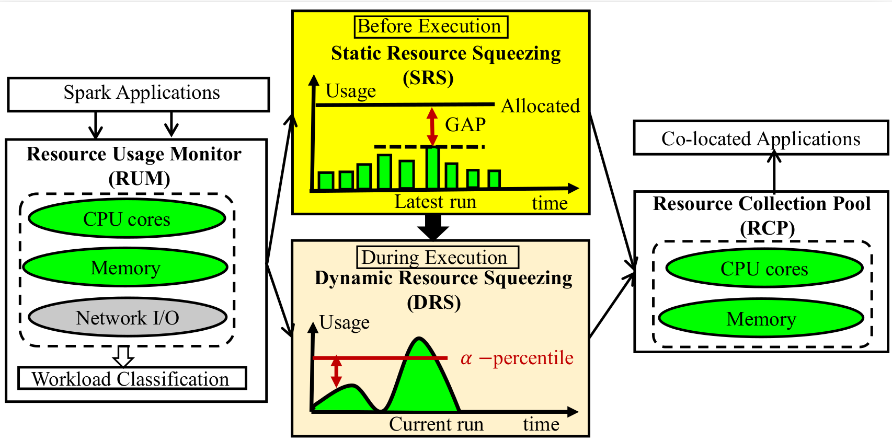
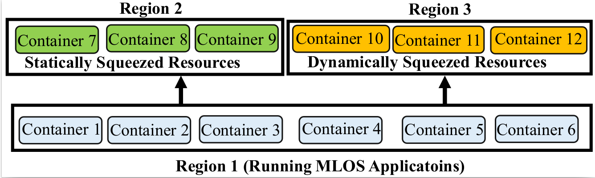

# sigmod-2023-presser

## PRESSER Architecture

PRESSER is a hybrid static dynamic mechainism atop Hadoop YARN to squeeze unused resources (i.e. CPU cores and memory) from Machine Learning Optimized Apach Spark (MLOS) applications by historical observations. The static mechanism called GAP squeezes the "gap amount" of resoruces between a MLOS application's peak used and allocated resource amount based on its last execution before it starts tis next execution. The dynamic mechanism, called $\alpha-CAP$ monitors the resource usages of a MLOS applications durign its execution per second and dynamically squeezes the "gap amount" of resources between  $\alpha$ percentile of allocated resources and its acutally used ones. The squeezed resources from GAP and  $\alpha-CAP$ can be reprovisioned to other co-located applications to improve cluster resource utilziation and system throughput.  
   

## Prerequisites
Docker 20, Docker swarm, Spark 2.3.0, Hadoop 2.7.7, Ubuntu 18.04.2 LTS , OpenJDK 8,  Python 3, Anaconda 3, pandas

## Basic Usage

Our expxperimental cluster is a docker cluster. In total, we launch 12 Docker containers. As shown in the following figure, we divides the 12 Docker containers into 3 regions. The first region with 6 Docker containers is to run the aforementioned 23 MLOS applications. The second region with 3 Docker containers leverages the statically squeezed resources from the MLOS applications in the first region to run the 81 non-MLOS applications randomly. And the third region also contains 3 Docker containers and reallocates the dynamically squeezed resources from MLOS applications to co-located applications. Each region deploys Hadoop 2.7.7 as the software infrastructure. The Spark framework employs Hadoop YARN as the underlying resource manager.

The experimental setup is as follow. Each Container is a Docker container.
  

In the directory **/codes**, The "**static-squeezing**" folder contains the codes to implement PRESSER's GAP machanism and "**dynamic-squeezing**" folder contains the codes of desgining  PRESSER's $\alpha-CAP$ machanism.
PRESSER leverage the docker command "**docker stats**" to record the resource usages of each MLOS appications in GAP machanism. And $\alpha-CAP$ machanism employ the docker command  "**docker update**" to limit the available CPU and memory resources of a Docker container. By dynamically limiting the CPU mand memory resources of a container where a non-MLOS application runs, $\alpha-CAP$ achieves the objective that squeezing CPU and memory resources from Docker containers running MLOS applications to Docker containers executing non-MLOS applications. 

## Experimental Results
### Workloads
We evaluate PRESSER on a 6-node cluster by all 104 Spark-SQL queries from TPC-DS. The experimental results show that PRESSER can improve the CPU and memory utilization by 31% and 20% on average, respectively. As a result, PRESSER at least doubles the throughput of the cluster by running more applications on the squeezed resources, significantly improving the resource efficiency. However, we do not make all 104 queries of TPC-DS, but only 23 queries of them as MLOS applications because the performances of these 23 queries are sensitive to Spark configuration tuning [59]. **The 23 queries are {Q14a,Q14b, Q15, Q20, Q21, Q23a, Q23b, Q29, Q33, Q40, Q41, Q43, Q50,Q54, Q57, Q58, Q62, Q64, Q69, Q70, Q72, Q95, Q99}**. For the other 81 queries, such Q1, Q2, and Q3, PRESSER regards them as non-MLOS applications and co-locates them with the 23 MLOS queries.

### Resource Saving

The squeezed resources of each MLOS application can ben seen in the directory **/squeezed-resources-MLOS_100G** and **/squeezed-resources-MLOS_500G** with input data of 100 and 500 GB, respectively. Each MLOS application is associated with an jupyter notebook. For example, **presser-dac-500G-6-containers-q15.ipynb** shows the amount of squeezed resources for the MLOS application Q15 with 500GB of input data. Users can open this jupyter notebook and its related data is located in the folder  **/data**. 

### Resource Efficiency

For the time dimension evaluation, we compare the CPU and memory utilization in each second between DAC and PRESSER. The results are in the folder **/MLOS-resource-effficiency**.DAC can only co-run 23 MLOS applications in the experimental cluster. In contrast, PRESSER can co-run not only the same 23 MLOS applications as DAC, but also other 23 non-MLOS queries by leveraging the squeezed resources from the MLOS applications.We show the results for CPU and memory in 300 and 500 seconds when the applications process 100GB and 500GB of data, respectively. 

The file "presser-ten-workloads-500G-0928-14-containers-sig-presser-static-dy-10minutes.ipynb" is responbile for generating the "TPCds-500GB-cpu-runtime.pdf" and 
"TPCds-500GB-memory-runtime.pdf". And the file "presser-six-workloads-100G-0929-14-containers-sig-presser-static-dy-10minutes" is responbile for generating the "TPCds-100GB-cpu-runtime.pdf" and 
"TPCds-100GB-memory-runtime.pdf".

### Motivation
For the motivation part, we also provide the results with 8 MLOS applications in the folder **/motivation**. Please see the "motivation_nor_sum_mem_sigmod.pdf" for memory utilziation and "motivation_nor_sum_cpu_q15_500G_sigmod.pdf" for CPU utilization. The "motivation_cpu.ipynb" accounts for generating the CPU utilization and "motivation_cpu.ipynb" for memory utilization.

